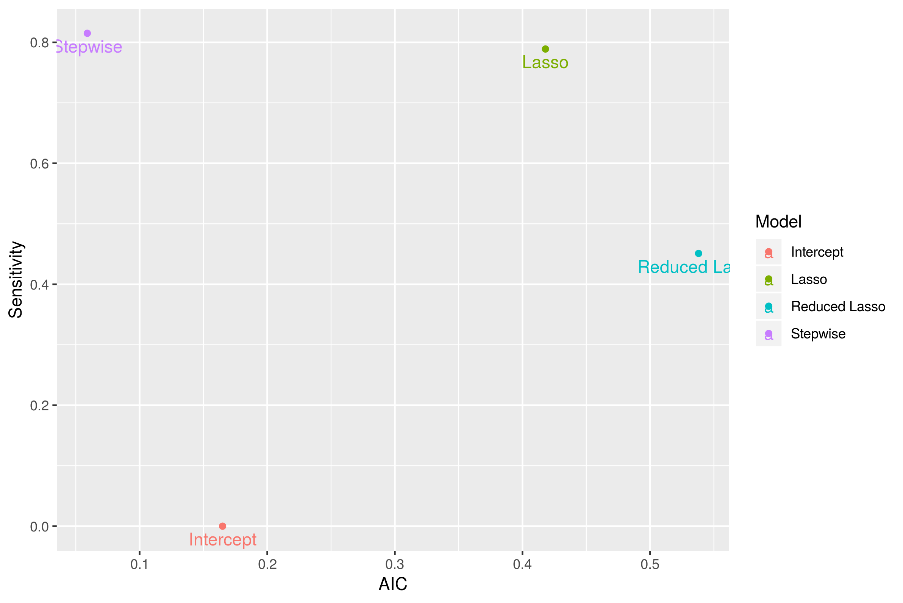

Final_Pres
========================================================
title: Predicting Deaths in Interstate Militarized Disputes
author: Yong, Koruna & Cleary
date: 
autosize: true

Introduction
========================================================

This projects looks at the militarized interstate dispute (MID) data compiled by the Correlates of War Project. 

- “Militarized interstate disputes are united historical cases of conflict in which the threat, display or use of military force short of war by one member state is explicitly directed towards the government, official representatives, official forces, property, or territory of another state. Disputes are composed of incidents that range in intensity from threats to use force to actual combat short of war” (Jones et al. 1996: 163).

Primary objective is to predict if a conflict resulted in any deaths.
- Number of challenges including need to clean data.

========================================================

Zach's logit
========================================================

- Base is a logit regression
- Used lasso to improve results
- Classic tradeoff of complixity vs potency
- Lasso also introduces bias/variance

***

Yong's logit
========================================================

Conclusion
========================================================

Ultimatly model outperformed expactations. Combination of better data-cleaning and lasso has produced impressive results.

|Model         | Accuracy| Acc p-Val| Sensitivity| Specificity|      AIC|
|:-------------|--------:|---------:|-----------:|-----------:|--------:|
|Intercept     |    0.792|     0.513|       0.000|       1.000| 2076.748|
|Stepwise      |    0.926|     0.000|       0.799|       0.960|  822.502|
|Lasso         |    0.925|     0.000|       0.787|       0.961|  861.132|
|Reduced Lasso |    0.834|     0.000|       0.244|       0.989| 1412.988|

***

FILLER Text
