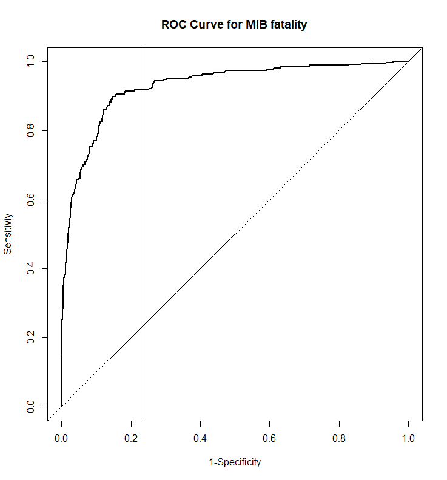
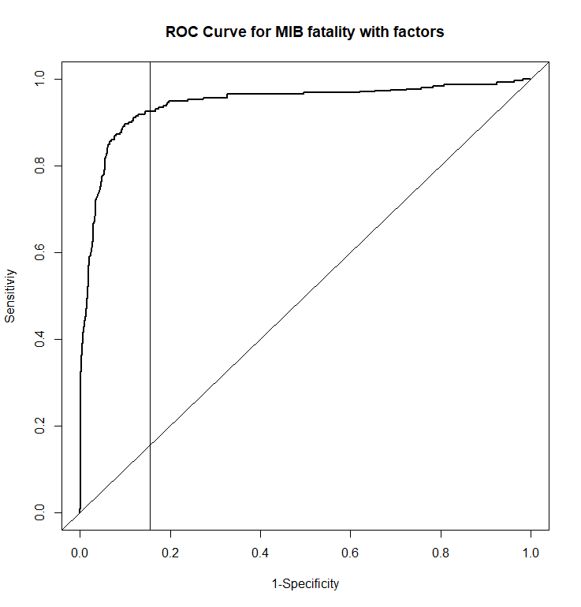

```{r setup, include=FALSE}
# Initialize all libraries in this chunk
library(texreg)
library(xtable) # I think it makes nicer tables see https://cran.r-project.org/web/packages/xtable/vignettes/xtableGallery.pdf


knitr::opts_chunk$set(echo = TRUE)
opts_chunk$set(eval=T,echo=F,fig.pos="H",results="hide",message=F,cache=T,fig.pos="H",wrapper=T)
options(xtable.comment = FALSE)
knitr::opts_chunk$set(fig.pos = 'H')
```

# Section header
## By John Doe

Lorem ipsum dolor sit amet, consectetur adipiscing elit. Integer feugiat sem vel nulla malesuada laoreet. Proin blandit vel tellus vitae molestie. Maecenas vel posuere purus. Nulla consequat sem nec neque congue, ullamcorper interdum ante cursus. Aenean et dapibus nunc. Vestibulum ante ipsum primis in faucibus orci luctus et ultrices posuere cubilia Curae; Mauris ut est quis eros porta hendrerit. Fusce condimentum justo odio, et dignissim arcu pharetra vehicula. Duis sagittis et dui eu lacinia.

```{r foo, echo=TRUE,results='asis'}
# you can override global settings on a by chunk basis
# can change output format
# can name codeblocks
```


#Modeling for B
##Data Cleaning  

Used Dplyr,tidyr,data.table libraries to manipulate the data more easily and made the cleaning procedure faster.  

* Dropped dispnum4,revtype2 because they contain too many missing values.  
* Dropped fatalpre because it contians missing values and highly correlated to fatality.  
* Dropped the last 4 variables which is unrelated.  
* Calculated the lasting days of the dispute based on the startdate and enddate and create a new variable called last_days, if one of the day of a date is missing, the first day of the month will be applied.  
* Dropped the missing rows where the fatality is missing and transfer fatality into a binary variable where 0 means no death while 1 means there is death.  

After the whole cleaning process, there are __8__ variables left in the data. The data dimension is __4459 X 8__ .All the variables we used in this data set are categorical instead of last_days which is numeric. However, even though they are categorical, they came in consecutive integers starting from 0. We wonder if there is much difference with our logistic model if converting these 7 special categorical variables into factor data type in R.  

## Model and Result
We randomly split the data into a training set and a testing test. 70% of the data randomly goes into the training set, the rest 30% goes into the testing set.  

### Logistic model  
For logistic regression, we used the training set to fit the model and the test set to predict the fatality level. The “fatality” is the respond, "sidea", "revstate","revtype1","fatality" ,"hiact","hostlev","orig" and   "last_days" are the predictors. After fitting the model, we calculated the AUC(Area under the curve), log-loss and misclassification rate for each model.(for each split and each model) Also, we employed ggplot2 to plot ROC curve and misclassification plot for the fitted value.  

#### Logistic model with numeric predictors
{width=380px}
{width=380px}

### Logistic model with factor predictors  
{width=380px}
{width=380px}  
From the ROC curve and the misclassification plot, we can see that the AUC for the two models are both good but apperantly the one with the factors are better with more curvy, meaning area under curve will be higher. As for the misclassification plot, we can easily see generally for the 0 class, there are less misclassification rate is less than class one, for the class one, the model with the factors has more way less red than the model with numeric type.  

#### Result  
Log-loss and AUC measure the performance of a classification model 
the lower log-loss is, the higher AUC is, the better the classifier is
Apparently, the model with the factor predictors has higher AUC, lower log-loss and lower misclassification rate. What it tells us is that do transfer your categorical variables into factors even though they look very numeric.  

Model        | AUC   | Log-loss | Misclassification rate
-------------|-------|----------|------------------------
Logi numeric |0.9249 |  0.2621  |  0.1399   
Logi factor  |0.9421 |  0.2185  |  0.0979

### Linear regression model to predict lasting days of a MID  
The lasting days of MIDs range from 1 to 4903, it would be very interesting to find the relationship between the lasting days and other predictors.   
1. we fitted a linear regression for lasting days. Then we used stepwise selection to perform model selection. We found that the residuals of the selected model with the lowest AIC turned out not following the normal distribution.    
2. Therefore, we transformed the respond into log-response and refitted the model.  

{width=380px}
<br>
There are some outliers but overall the residuals are constant variance.    

{width=380px} 
<br>
The trend is far from a straight line, therefore the residuals are not normally distributed.  

{width=380px}
<br>
After transformation, the residuals plot shows that the residuals are homogeneous with points evenly spreading out below and above 0.  

{width=380px}
<br>
Also the QQplot shows that the new residuals closely follow the normal distribution. Then we predicted the respond for the test data set and calculate for the RMSE(Root Mean Square Error) of 0.05467609 which indicates that the model is a good fit.  

