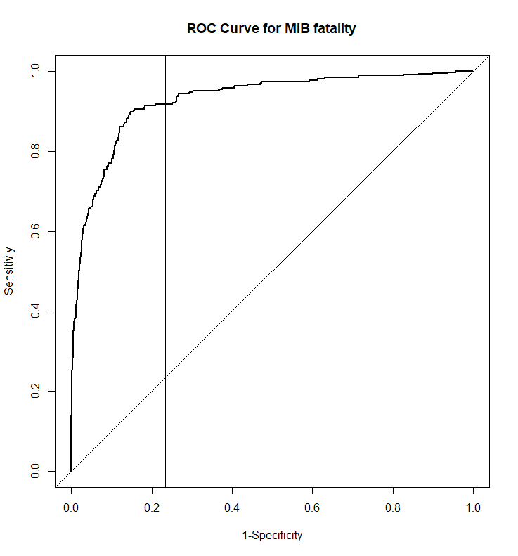
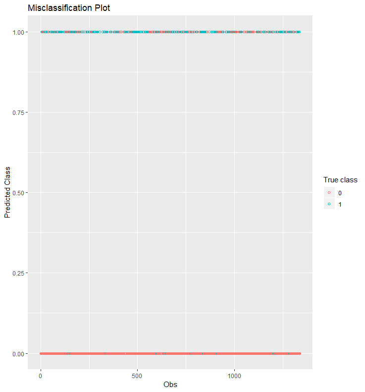
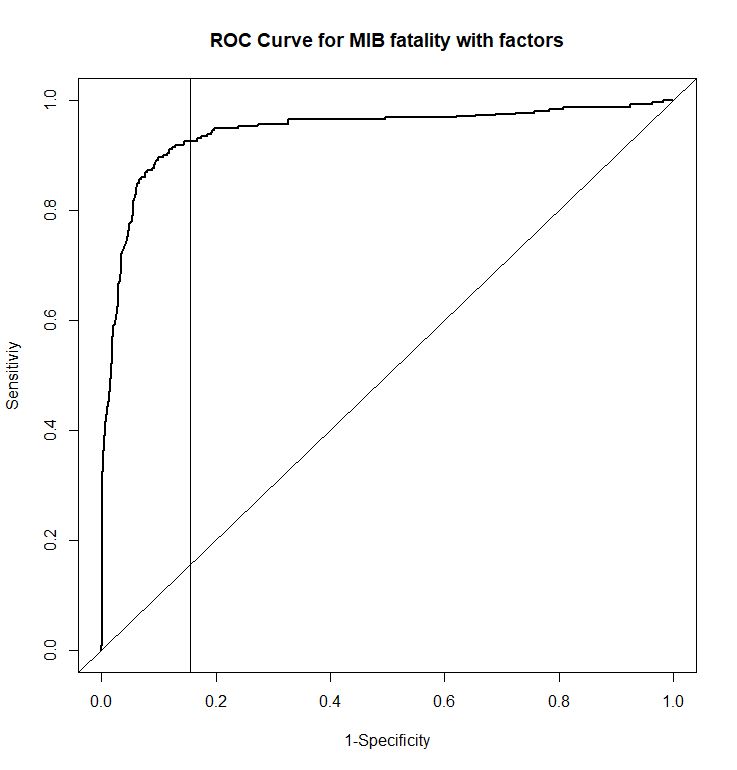
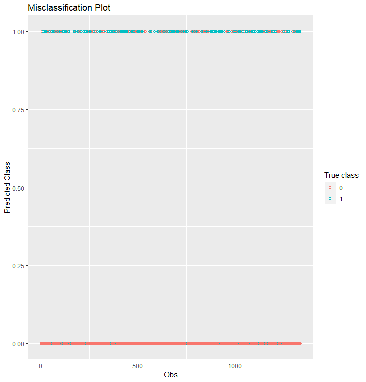
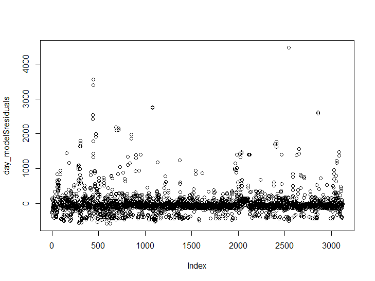
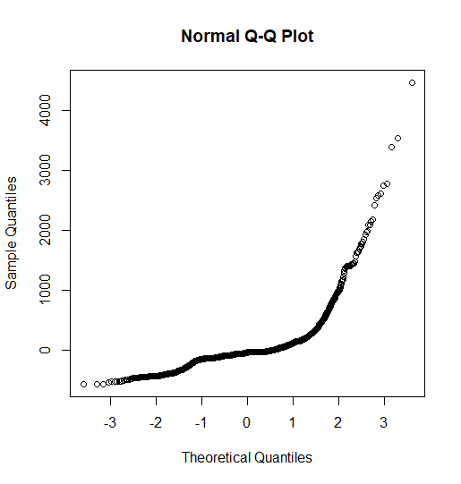
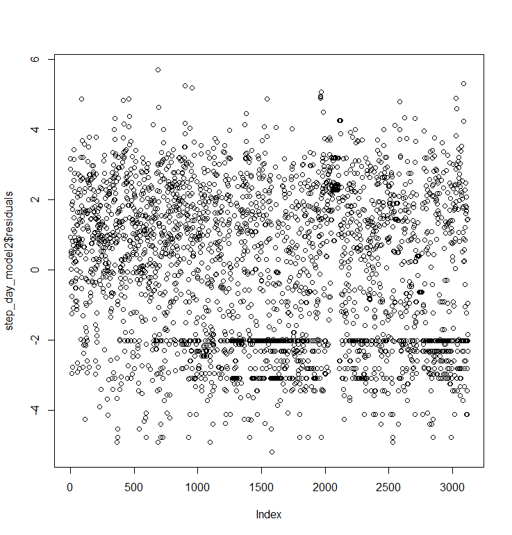
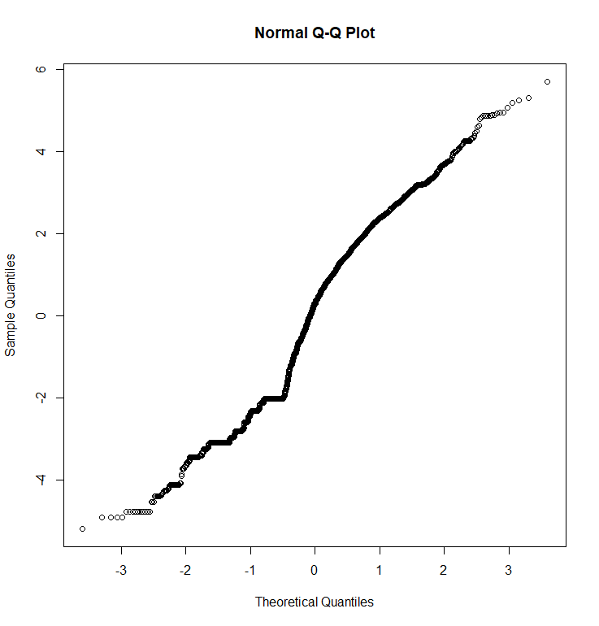

```{r setup, include=FALSE}
knitr::opts_chunk$set(eval=T,echo=F,fig.pos="H",results="hide",message=F,cache=T,wrapper=T)

# Initialize all libraries in this chunk
library(texreg)
library(xtable) # I think it makes nicer tables see https://cran.r-project.org/web/packages/xtable/vignettes/xtableGallery.pdf
library(boot)
library(glmnet)
library(ggplot2)
library(caret)
library(e1071)
library(data.table)
library(dplyr)
library(doParallel)
library(summarytools)
options(xtable.comment = FALSE)

set.seed(1569787)
```

# Brief Introduction
## Zach Cleary's Work

Militirized interstate disputes (MIDs) are tense moments in international diplomacy. The formal definition is “Militarized interstate disputes are united historical cases of conflict in which the threat, display or use of military force short of war by one member state is explicitly directed towards the government, official representatives, official forces, property, or territory of another state. Disputes are composed of incidents that range in intensity from threats to use force to actual combat short of war” (Jones et al. 1996: 163). Whenever a MID occurs there is a risk of violence and deaths. Our objective is to attempt to predict if a given incident will results in fatalities. While the vast majority of MIDs do not result in fatalities those that do can have signifigant impacts. To do so we have drawn upon the Correlates of War extensive MID data. Said data is split into two data-sets. The A data-set is organized by incident and the B by actor.

# MIDA Models
## Zach Cleary's Work
## Description of MIDA and Goal

MIDA is the portion of the MID data organized by actor. The primary objective of this section is to fit a relatively simple but effective logistic regression for predicting if there will be fatalities. Several models are fitted and then compared in the concluding portion of this segment. The full summary statistics are presented in an appendix at the end of the report. However, a few variables require explation before proceeding.

* outcome: A catagorical variable that records how the conflict ended.
* settle: A catagorical variable that records manner in which the final agreement was made. Was the final settlment negotiated or imposed?
* hiact & hostlev: Strongly related ordinal variables that measure the level of escalation reached.
* deaths: The boolean objective variable. It is true if there were deaths.

Since hiact and hostlev are arguably too potent a more limited model is fitted without them.

## Data Cleaning

```{r initial}
# Note that this does rely upon the code in the "Data Cleaning" file.

## Loading data

Raw_Data<-readRDS("MIDA_4.2_Cleaned.rds")

## Problem 1 the excessive NAs
NAcount<-colSums(is.na(Raw_Data))


## Some quick pruning
NNA_Data<-as.data.table(na.omit(Raw_Data[,c(4:5,7:10,13:19,23,27)]))
```
```{r, results='asis'}
xtable(as.table(NAcount[NAcount != 0]),caption="Counts of NA entries",include.colnames=FALSE)
```

Before fitting any models the data required a second round of cleaning utilizing data.table. This mostly consisted of the following actions:

* Removing purely administrative variables such as the MIDs internal ID number.
* Dropping the fatalpre and fatality variables as they were redundant given the objective variable.
* Dropping variables such as endday that were deemed uninteresting/unnecessary. The end month might give insight into fighting seasons but days have no such value.
* Omitting all MIDs with missing values. Since this step is performed last the 2030 missing dispnum4 entries are not a problem.

This last action was necessary for the modeling techniques I used but did result in a ~12% reduction in entries. More problematically it probably biased the resulting models as prior analysis indicates that violent incidents are more likely to having missing information.

## Baseline Models

```{r, warning=FALSE}
## Create a crude logit model, mostly for comparison purposes
dlogit_intercept<-glm(deaths~1,data=NNA_Data,family = "binomial")
fullformula<-paste("deaths~",paste(colnames(NNA_Data[,-14]),collapse = "+"))
dlogit_step<-step(dlogit_intercept,scope = fullformula,direction = "both")
## Version built to permit cv
NNA_Data_hiactCond<-NNA_Data
levels(NNA_Data_hiactCond$hiact)<-list("1"='1',"3"=c("2","3","4"),"7"="7","8"="8","10"="10","11"="11","12"="12",
                                 "13"="13","14"="14","15"="15","16"="16","17"="17","18"=c("18","19"),
                                                           "20"="20","21"=c("21","22"))
```

Two models were created for comparison purposes. One is a simple intercept only model. The second is the product of automated step-wise selection based on the AIC starting from the intercept only model. The step-wise selection process throws out numerous warnings stating that "fitted probabilities numerically 0 or 1 occurred." This is expected behavior. The ordinal variables (hiact,hostlev) have not been converted to numeric approximations. This means that the glm function attempts to use k-1 polynomial contrasts. Unfortunately, there is not sufficient data to fully support this and thus the warnings. If the intention was to proceed with a glm() based model steps would be taken to rectify the situation. However, in this case it is intentionally left to show the improvement of the alternative method.

## LASSO Models

```{r}
## Using more sophisticated approach (Lasso)

x.mm<-model.matrix(~.,NNA_Data[,1:13])

# Parallel used to improve speed.
registerDoParallel(16)
cv.dlogit_lasso<-cv.glmnet(x.mm,NNA_Data$deaths,family="binomial",alpha = 1,nfolds = 10)
stopImplicitCluster()

## Now without hiact and hostlevel

x.mm2<-model.matrix(~.,NNA_Data[,c(1:7,10:13)])
registerDoParallel(16)
cv.dlogit_lasso_limited<-cv.glmnet(x.mm2,NNA_Data$deaths,family="binomial",alpha = 1,nfolds = 10)
stopImplicitCluster()
```

In order to simultaneously improve results and conduct variable selection the least absolute shrinkage and selection operator (LASSO) technique was utilized in addition to the logistic regression. This was accomplished via the cv.glmnet() function of the glmnet package. While a complete explanation of the LASSO technique is beyond the scope of this project there are a few elements that require exploration. I utilized cv.glmnet()'s built in parallel comparability as the function can be computationally expensive. The cv.glmnet function fits #folds+1 LASSO logistic regressions. The first fit is used to produce a sequence of lambda values (the tuning parameter) and the rest are traditional cv fits to evaluate the model. The performance of the various lambda values can be seen below. I have chosen to select not the lambda that minimizes the mean cross-validated error but "lambda.1se" ( `r round(cv.dlogit_lasso$lambda.1se,3)` for the main LASSO model) which is the lambda within one standard error that gives the most regularized model. This is due to desire to use LASSO as a variable selection technique. The second plot below shows how the lambda values influence the coefficients. From right to left the two lines represent the lambda which minimizes error and the lambda.1se. It is apparent that using lambda.1se results in a significantly simpler model.

```{r LASSO plots}
par(mfrow=c(1,2))
plot(cv.dlogit_lasso,main="Lambda Selection")
plot(cv.dlogit_lasso$glmnet.fit,"lambda",main="Coefficient Shrinkage")
abline(v=log(cv.dlogit_lasso$lambda.min))
abline(v=log(cv.dlogit_lasso$lambda.1se))
par(mfrow=c(1,1))
```

## Model Comparisons

```{r,warning=FALSE}
# This contains all the predicted values (post-link)
ResDat<-data.frame("Intercept"= predict(dlogit_intercept,type = "response"),
                   "Step"= predict(dlogit_step,type = "response"),
                   "Lasso"= unname(predict(cv.dlogit_lasso,newx = x.mm,s="lambda.1se",type="response")),
                   "Limited"= unname(predict(cv.dlogit_lasso_limited,newx = x.mm2,s="lambda.1se",type="response")))

# A function to calculate log likelihood b/c for some reason I couldn't find one
logitLL<-function(fit,real){
  n<-length(real)
  indvll<-vector(length=n)
  for(i in 1:n){
    indvll[i]<-real[i]*log(fit[i])+(1-real[i])*log(1-fit[i])
  }
  return(sum(indvll))
}

# Just to speed up repeat calls
AIChack<-function(cv.model,fit,real,penalty=2){
  p<-nnzero(coef(cv.model,s="lambda.1se"))
  return(-2*logitLL(fit,real)+2*p)
}

# This thing exploits the fact that cv.glmnet returns coefficients as sparse matrixes
extractcoef<-function(cv.model){
  allcoef<-coef(cv.model,s="lambda.1se")
  res<-allcoef[which(allcoef !=0)]
  names(res)<-dimnames(allcoef)[[1]][which(allcoef !=0)]
  return(res)
}

## Misclass
### Takes the fitted results and makes a true/false call
transFitted<-function(fittedresults,divide=.5){
  n<-length(fittedresults)
  res<-rep(FALSE,n)
  for(i in 1:n){
    if(fittedresults[i]>divide){
      res[i]<-TRUE
    }
  }
  return(res)
}

# For combining the outputs of multiple confusionMatrix() calls
confAll<-function(oddsDat,trueDat){
  N<-dim(oddsDat)[2]
  res<-vector(mode="list",length=N)
  for(i in 1:N){
    res[[i]]<-confusionMatrix(as.factor(transFitted(oddsDat[,i])),
                            as.factor(trueDat),
                            positive = "TRUE")
  }
  return(res)
}

# The results
confusion_mats<-confAll(ResDat,NNA_Data$deaths)

# A quick function for extracting things from above
getVfromLiL<-function(x,l1,l2) x[[l1]][[l2]]

# To see where these two files came from see the chunk titled "codeappendix" at the end of the document
allcoef<-readRDS("coefficients.rds")
finalres<-readRDS("cleary_concsum.rds")
```
```{r,results='asis'}
print.xtable(xtable(finalres,caption="Overview of results"),floating = TRUE)
```

Table two above shows the summarizes key measures about the performance of all the models while table three below displays their coefficients. As can be seen the step-wise model is by far the most complicated. This is why the LASSO model is preferred even though it performs marginally worse. The deviance values are calculated from 10-fold cross validation. It is clear that the key performance metric is sensitivity. Most MIDs do not end in deaths but correctly predicting those rare instances are crucial. Thus it is unacceptable to use a model such as the intercept with relatively high accuracy but abysmal sensitivity. It is also noteworthy that the reduced LASSO model is still relatively effective predictor even though it lacks to potent retrospective variables hiact and hostlev.

```{r,results='asis'}
print.xtable(xtable(allcoef,caption = "Coefficients from all models"),floating = TRUE)
```

\pagebreak

# Modeling for B
## Yong's Work
## Data Cleaning  

Used Dplyr,tidyr,data.table libraries to manipulate the data more easily and made the cleaning procedure faster.  

* Dropped dispnum4,revtype2 because they contain too many missing values.  
* Dropped fatalpre because it contians missing values and highly correlated to fatality.  
* Dropped the last 4 variables which is unrelated.  
* Calculated the lasting days of the dispute based on the startdate and enddate and create a new variable called last_days, if one of the day of a date is missing, the first day of the month will be applied.  
* Dropped the missing rows where the fatality is missing and transfer fatality into a binary variable where 0 means no death while 1 means there is death.  

After the whole cleaning process, there are __8__ variables left in the data. The data dimension is __4459 X 8__ .All the variables we used in this data set are categorical instead of last_days which is numeric. However, even though they are categorical, they came in consecutive integers starting from 0. We wonder if there is much difference with our logistic model if converting these 7 special categorical variables into factor data type in R.  

## Model and Result
We randomly split the data into a training set and a testing test. 70% of the data randomly goes into the training set, the rest 30% goes into the testing set.  

### Logistic model  
For logistic regression, we used the training set to fit the model and the test set to predict the fatality level. The “fatality” is the respond, "sidea", "revstate","revtype1","fatality" ,"hiact","hostlev","orig" and   "last_days" are the predictors. After fitting the model, we calculated the AUC(Area under the curve), log-loss and misclassification rate for each model.(for each split and each model) Also, we employed ggplot2 to plot ROC curve and misclassification plot for the fitted value.  

#### Logistic model with numeric predictors
{width=380px}
{width=380px}

### Logistic model with factor predictors  
{width=380px}
{width=380px}  
From the ROC curve and the misclassification plot, we can see that the AUC for the two models are both good but apperantly the one with the factors are better with more curvy, meaning area under curve will be higher. As for the misclassification plot, we can easily see generally for the 0 class, there are less misclassification rate is less than class one, for the class one, the model with the factors has more way less red than the model with numeric type.  

#### Result  
Log-loss and AUC measure the performance of a classification model 
the lower log-loss is, the higher AUC is, the better the classifier is
Apparently, the model with the factor predictors has higher AUC, lower log-loss and lower misclassification rate. What it tells us is that do transfer your categorical variables into factors even though they look very numeric.  

Model        | AUC   | Log-loss | Misclassification rate
-------------|-------|----------|------------------------
Logi numeric |0.9249 |  0.2621  |  0.1399   
Logi factor  |0.9421 |  0.2185  |  0.0979

### Linear regression model to predict lasting days of a MID  
The lasting days of MIDs range from 1 to 4903, it would be very interesting to find the relationship between the lasting days and other predictors.   
* We fitted a linear regression for lasting days. Then we used stepwise selection to perform model selection. We found that the residuals of the selected model with the lowest AIC turned out not following the normal distribution.    
* Therefore, we transformed the respond into log-response and refitted the model.  

{width=380px}
<br>
There are some outliers but overall the residuals are constant variance.    

{width=380px} 
<br>
The trend is far from a straight line, therefore the residuals are not normally distributed.  

{width=380px}
<br>
After transformation, the residuals plot shows that the residuals are homogeneous with points evenly spreading out below and above 0.  

{width=380px}
<br>
Also the QQplot shows that the new residuals closely follow the normal distribution. Then we predicted the respond for the test data set and calculate for the RMSE(Root Mean Square Error) of 0.05467609 which indicates that the model is a good fit.  


\newpage

# Citation

Palmer, Glenn, Vito D'Orazio, Michael R. Kenwick, and Roseanne W. McManus. Forthcoming. “Updating the Militarized Interstate Dispute Data: A Response to Gibler, Miller, and Little.” International Studies Quarterly.

# MIDA Appendix: Complete Summary

```{r,results='asis'}
dfSummary(NNA_Data,graph.col=FALSE,plain.ascii = FALSE,style = "grid")
```


```{r codeappendix,warning=FALSE,eval=FALSE}
# The code in this chunk is not actually used as I have already created outputs that I can just read in. However it is available here to see how that was made without rooting through my mad scratchpad (death_logit)

# This first section produces coefficients.rds

#Getting the coef from each model
coeflist<-vector(mode="list",length=4)
coeflist[[1]]<-coef(dlogit_intercept)
coeflist[[2]]<-coef(dlogit_step)
coeflist[[3]]<-extractcoef(cv.dlogit_lasso)
coeflist[[4]]<-extractcoef(cv.dlogit_lasso_limited)

# This function is super hacky but it works. Objective is to merge all the coef lists into something easily displayable. I have a saved version as an .rds but I wanted to show how the sausage was made
coefmerger <-function(listofcoef){
  n<-length(listofcoef)
  res<-data.frame("Coef"=factor())
  for(i in 1:n){
    temp<-data.frame("Coef"=names(listofcoef[[i]]),unname(listofcoef[[i]]))
    res<-full_join(res,temp,by="Coef")
  }
  return(res)
}
# The warnings are proof that it works, no really

coefmat<-coefmerger(coeflist)
colnames(coefmat)[-1]<-c("Intercept","Stepwise","Lasso","Reduced Lasso")
rownames(coefmat)<-coefmat[,1]
coefmat[]<-round(coefmat[,-1],4)

# This second section produces cleary_concsum.rds

resMeasures<-data.table("Model"=c("Intercept","Stepwise","Lasso","Reduced Lasso"),
                        "Accuracy"=as.numeric(lapply(confusion_mats,getVfromLiL,"overall","Accuracy")),
                        "Acc p-Val"=as.numeric(lapply(confusion_mats,getVfromLiL,"overall","AccuracyPValue")),
                        "Sensitivity"=as.numeric(lapply(confusion_mats,getVfromLiL,"byClass","Sensitivity")),
                        "Specificity"=as.numeric(lapply(confusion_mats,getVfromLiL,"byClass","Specificity")),
                        "Deviance"=c(cv.glm(NNA_Data,dlogit_intercept,K=10)$delta[[1]],
                                     cv.glm(NNA_Data_hiactCond,dlogit_step,K=10)$delta[[1]],
                                     cv.dlogit_lasso$cvm[which(cv.dlogit_lasso$lambda == cv.dlogit_lasso$lambda.1se)],
                                     cv.dlogit_lasso_limited$cvm[which(cv.dlogit_lasso_limited$lambda == cv.dlogit_lasso_limited$lambda.1se)]),
                        "AIC"=c(AIC(dlogit_intercept),
                                AIC(dlogit_step),
                                AIChack(cv.dlogit_lasso,ResDat$Lasso,as.numeric(NNA_Data$deaths)),
                                AIChack(cv.dlogit_lasso_limited,ResDat$Limited,as.numeric(NNA_Data$deaths))))


resMeasures[,Model := as.factor(Model)]
dispRes<-resMeasures
dispRes[,c("Accuracy","Acc p-Val","Sensitivity","Specificity","Deviance","AIC") := round(resMeasures[,-1],3)]

```
